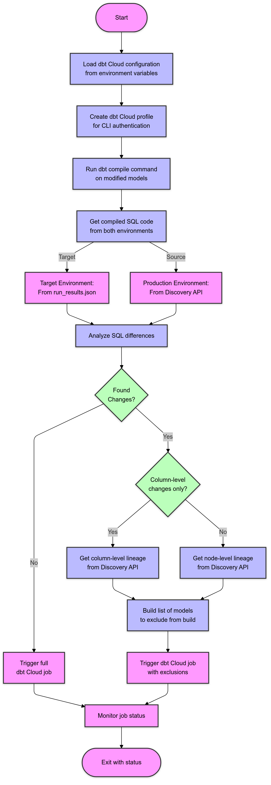
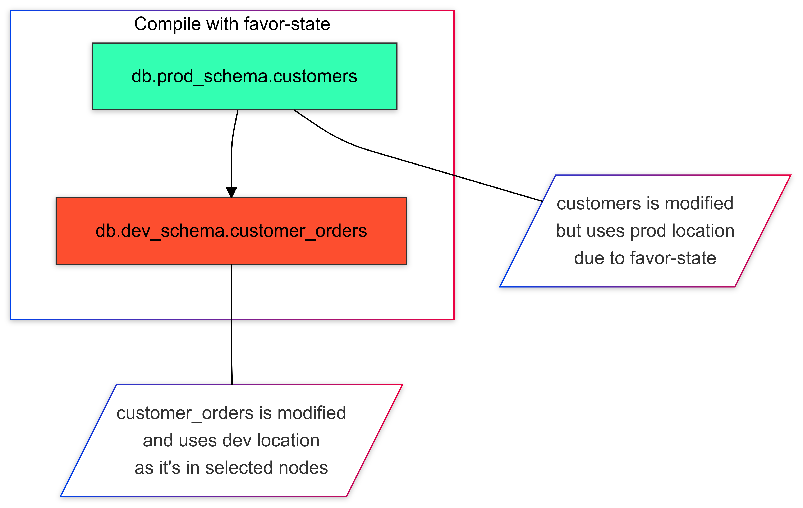

# dbt Cloud Column-Aware CI Action

This GitHub Action enables column-aware CI for dbt Cloud Enterprise accounts by leveraging dbt Cloud's column-level lineage feature. It intelligently determines which downstream models need to be rebuilt based on column-level changes in your dbt models.

## Overview

Traditional dbt CI runs rebuild all downstream dependencies when a model changes. This action optimizes CI runs by:
1. Analyzing which columns have changed in modified models
2. Using dbt Cloud's column-level lineage to identify affected downstream models
3. Excluding unaffected downstream models from the CI run

This results in faster CI runs and more efficient use of warehouse resources.

## Benefits

- **Faster CI Runs**: Only rebuild models that are actually impacted by column changes
- **Resource Optimization**: Reduce warehouse costs by skipping unnecessary model runs
- **Enhanced Developer Experience**: Get faster feedback on your PRs
- **Enterprise Integration**: Seamlessly works with dbt Cloud Enterprise features

## Prerequisites

- dbt Cloud Enterprise account
- A `dbt docs generate` command should be run in at least one job in your environment that the CI job defers to.  This is what enables column-level lineage.  More info [here](https://docs.getdbt.com/docs/collaborate/column-level-lineage#access-the-column-level-lineage).
- A dbt Cloud [Personal access token](https://docs.getdbt.com/docs/dbt-cloud-apis/user-tokens#create-a-personal-access-token)
- A dbt Cloud [Service token](https://docs.getdbt.com/docs/dbt-cloud-apis/service-tokens) with the following permissions:

| Permission | Usage | 
|-------|-------------|
| Metadata | Used to return column-level lineage and compiled code |
| Job Runner | Used to trigger the CI job configured in the workflow |
| Job Viewer | Used to infer the deferring environment ID if not given as part of the workflow inputs |

## Inputs

| Input | Description | Required | Default |
|-------|-------------|----------|---------|
| `dbt_cloud_service_token` | dbt Cloud Service Token | Yes | - |
| `dbt_cloud_token_value` | dbt Cloud Personal API Key for use with the dbt Cloud CLI | Yes | - |
| `dbt_cloud_token_name` | Name of the personal API Key created in dbt Cloud | Yes | - |
| `dbt_cloud_account_id` | dbt Cloud Account ID | Yes | - |
| `dbt_cloud_project_id` | dbt Cloud Project ID | Yes | - |
| `dbt_cloud_project_name` | dbt Cloud Project Name | Yes | - |
| `dbt_cloud_job_id` | dbt Cloud CI Job ID for the current project | Yes | - |
| `dbt_cloud_host` | dbt Cloud host | No | cloud.getdbt.com |
| `dbt_cloud_environment_id` | dbt Cloud Environment ID for job deferral | No | Inferred from job |

## Usage

Here's an example workflow that uses this action:

```yaml
name: dbt Cloud CI
  on:
    pull_request:
      branches: [ main ]

jobs:
  dbt-cloud-ci:
    runs-on: ubuntu-latest
    steps:
    - uses: actions/checkout@v3
    - name: Run Column-Aware dbt Cloud CI
      uses: dpguthrie/dbt-cloud-column-aware-ci@0.1.0
      with:
        dbt_cloud_service_token: ${{ secrets.DBT_CLOUD_SERVICE_TOKEN }}
        dbt_cloud_token_name: 'github-actions'
        dbt_cloud_account_id: '12345'
        dbt_cloud_project_id: '67890'
        dbt_cloud_project_name: 'my-dbt-project'
        dbt_cloud_job_id: '98765'
```

## How It Works

1. The action identifies modified models using dbt's state comparison
2. For each modified model, it:
   - Compiles the current and previous compiled code.  The current code is retrieved from running a `dbt compile` and the previous code is retrieved from the discovery API.
   - Create a diff between the current and previous code.  Specifically, looking for changes to columns
   - Queries dbt Cloud's Discovery API to find impacted downstream models from the columns that had changes
3. Creates a filtered CI run that excludes unaffected downstream models
4. Monitors the job run and reports status back to GitHub



## Codebase Structure

### Core Components

#### Configuration (`src/config.py`)
- Manages application configuration through the `Config` class
- Handles dbt Cloud credentials and settings
- Provides environment variable parsing via `from_env()`

#### Main Entry Point (`src/main.py`)
- Sets up logging configuration
- Initializes the application configuration
- Creates and runs the CI orchestrator
- Handles top-level error handling

### Models (`src/models/`)

- `Node`: Represents a dbt model with source and target code
- `NodeFactory`: Creates Node instances from raw data
- `NodeManager`: Manages collections of nodes and their dependencies
- `BreakingChange`: Analyzes SQL changes to detect breaking modifications
- `ColumnTracker`: Tracks column-level changes across models

### Services (`src/services/`)

#### Core Services
- `CiOrchestrator`: Coordinates the entire CI workflow
- `DbtRunner`: Handles dbt CLI command execution
- `DiscoveryClient`: Interfaces with dbt Cloud's Discovery API
- `LineageService`: Manages model lineage information

#### Interface Definitions (`src/interfaces/`)
- Defines protocol classes for key components
- Ensures consistent implementation across services
- Includes protocols for:
  - `DbtRunnerProtocol`
  - `DiscoveryClientProtocol`
  - `LineageServiceProtocol`
  - `OrchestratorProtocol`

### Utilities

#### Support Functions (`src/utils.py`)
- Contains helper functions for:
  - Creating dbt Cloud profiles
  - Triggering dbt Cloud jobs
  - Managing job run statuses

#### GraphQL Queries (`src/discovery_api_queries.py`)
- Defines GraphQL queries for the Discovery API
- Includes queries for:
  - Column lineage
  - Compiled code
  - Node lineage

#### Logging Configuration (`src/logging_config.py`)
- Sets up standardized logging across the application
- Configures console output formatting
- Defines log levels and handlers

## Caveats

- Only been tested with Snowflake
- Assumes that your column names are **not** case sensitive.
- The dbt Cloud CLI is used to run dbt commands `compile` and `ls`, which means that it needs a personal access token and is at the moment scoped to a particular user.  The job itself that is triggered at the end of the workflow would still use the credentials configured for the enviroment it's running in.
- The `favor-state` flag is used when compiling the target SQL.  This is done to try and minimize any changes that are picked up solely because of environment separation (e.g. db.my_dev_schema.dim_customers vs. db.my_prod_schema.dim_customers).  However, this doesn’t apply if the node is also part of the selected nodes.  See example below when running `dbt compile -s state:modified --favor-state`:



## Contributing

Contributions are welcome! Please feel free to submit a Pull Request.

## License

This project is licensed under the terms of the MIT license.